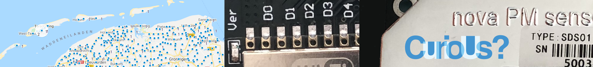
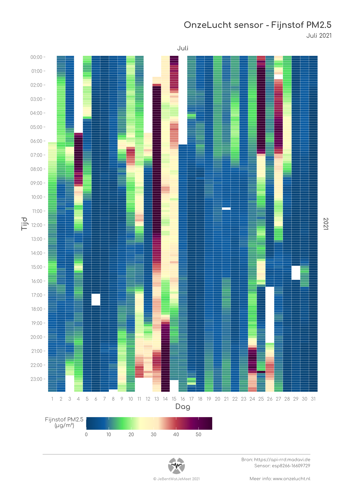
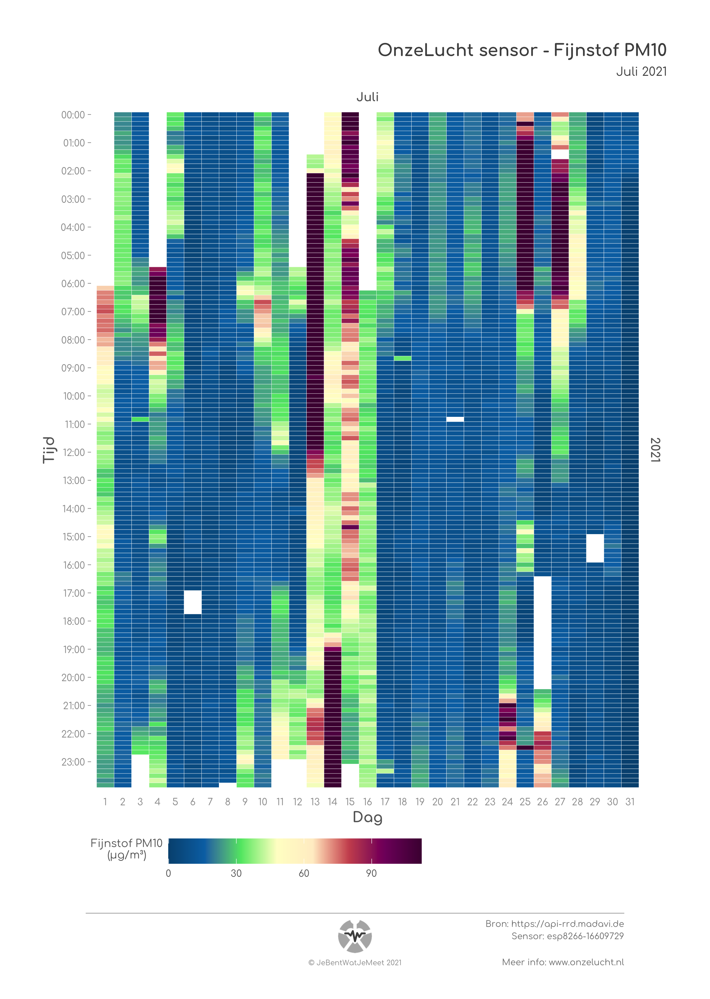
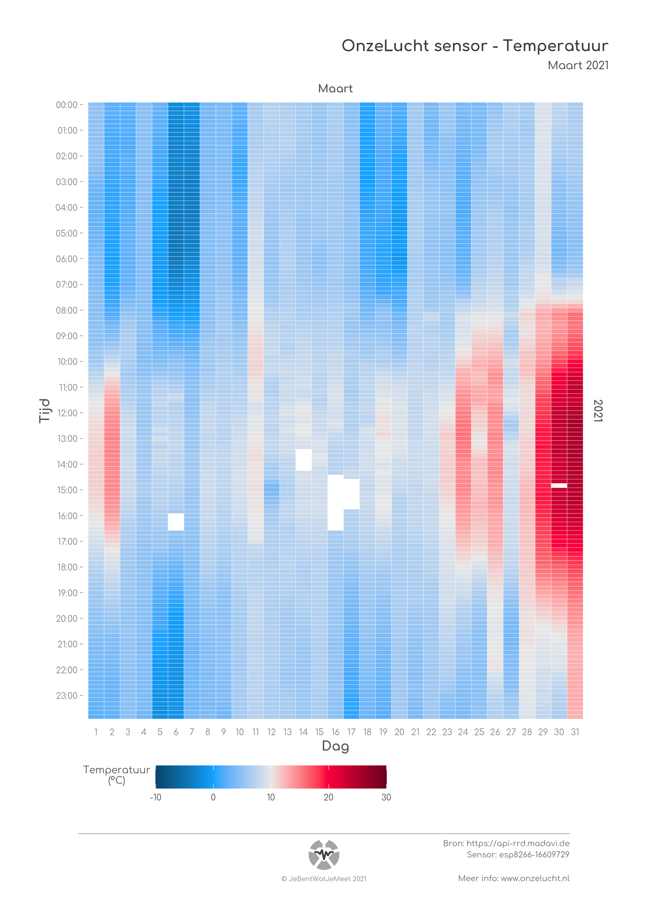
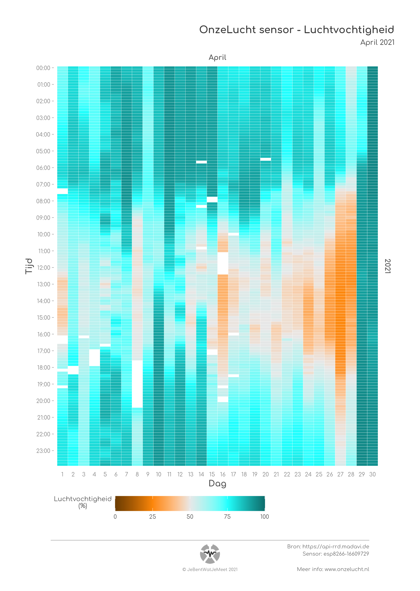

## Onze Lucht

[Onze Lucht](https://onzelucht.nl) is a citizen science project where citizens in the North of the Netherlands monitor air quality in their living environment using home-build sensors that measure PM2.5, PM10, temperature and humidity. 

I created an **R Shiny** app that allows participants to access their monthly data using their personal sensor-id. The monthly data is visualized in **interactive heatmaps** created with `ggplotly` based on the static heatmaps illustrated below.

You can view the R Shiny app on [shinyapps.io](https://jebentwatjemeet.shinyapps.io/OnzeLucht/)

---

### Air Quality PM2.5

---

### Air Quality PM10

---

### Temperature

---

### Humidity

