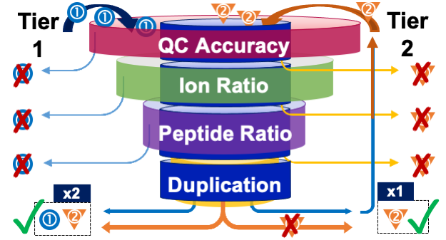

## Abstract

**INTRODUCTION**: Increased throughput as well as increased multiplexing of selected reaction monitoring mass spectrometry (SRM-MS) assays challenges routine data-analysis. SRM-MS for the quantification of protein biomarkers particularly generates large amounts of data as each protein is measured by multiple SRM transitions from multiple signature peptides. For clinical decision making, nonetheless, the results are interpreted at the individual protein level and only one (quantifier) transition from one (quantifier) peptide is needed to represent the protein abundance. Consequently, data-analysis is spent majorly on data that not directly affects the quantitative result.

**OBJECTIVES**: For scaling data of this level of complexity, we developed a data-analysis process for quality control and outlier detection to support the generation of reliable and comprehensive results at the protein level. 

**METHODS**: Data was generated from 1481 dried blood samples collected with the Mitra® microsampling tips at 4 different time points from 176 individuals (1342 duplicate and 139 singlicate tips). An 11-protein multiplex SRM method targeting nine apolipoproteins (APOA1, APOA2, APOA4, APOB, APOC1, APOC2, APOC3, APOE, and APOJ), human serum albumin (ALBU) and hemoglobin A (HBA) was used, generating 132 chromatographic peaks per sample (11 proteins * 2 peptides * 3 transitions * 2 isotopologues). Peaks were manually checked for correct integration and each peptide was manually evaluated to meet accuracy criteria for at least 2 transitions before further processing using R software (version 3.6.0). 

**RESULTS**: Initial evaluation of data quality by (i) removal of tips marked as ‘incorrectly filled’; (ii) identification of incorrectly integrated, or missing, peptide peaks that have gone unnoticed during manual inspection; and (iii) identification of samples with a large % difference between duplicates for multiple proteins in the same sample, resulted in the selection of 1127 samples with good quality. Thereafter, thresholds for the detection of outliers in ion ratio, peptide ratio, and reproducibility of replicates were defined based on the ion’s or peptide’s specific variability in the selected data (with a set minimum and maximum threshold). In the 2-tiered data-analysis process, more stringent criteria were applied to samples without duplicates or to samples with a % difference between duplicates above a defined Tier 1 threshold. Ultimately, selection of quantifier transitions/peptides, removal of QC failures and outliers, and averaging of duplicates provided 6,085 protein-level results, equaling a 32-fold reduction in data-complexity and an inclusion rate of 91% based on the selected samples.

**CONCLUSION**: The described data analysis process serves as a starting-point towards a standardized data-analysis workflow for multiplexed SRM-MS protein assays.
